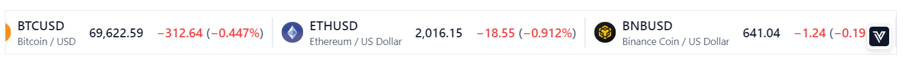
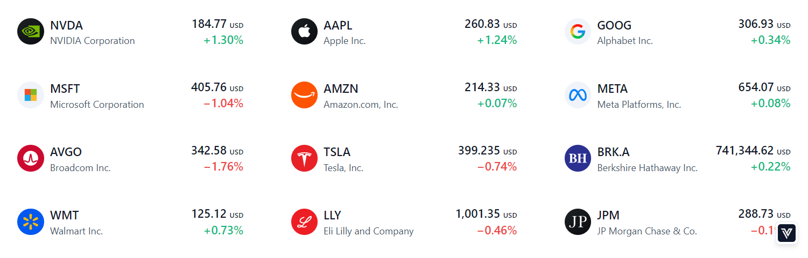
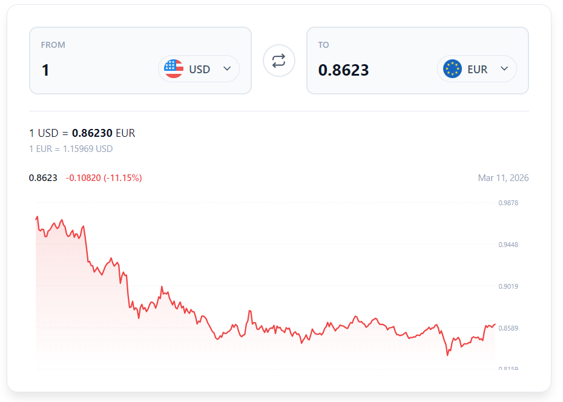
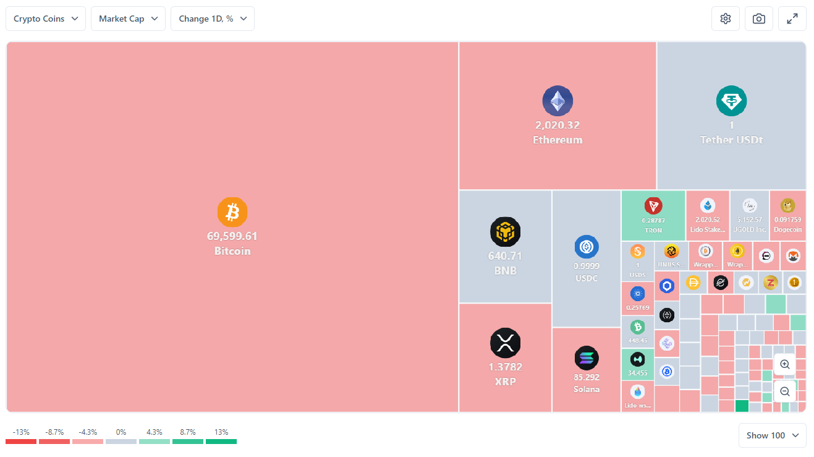
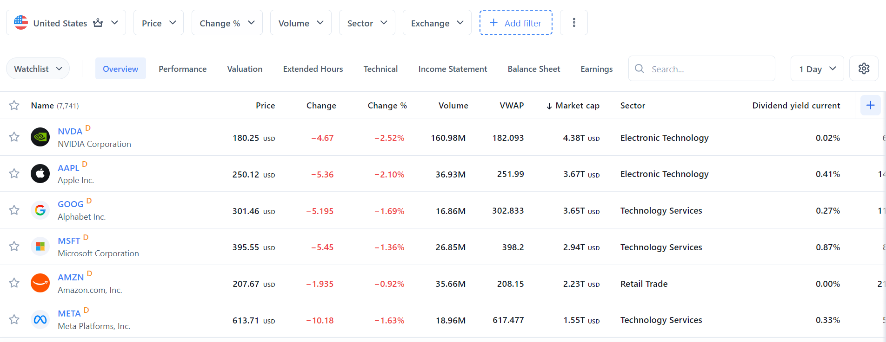

# Vunelix — Free Crypto, Forex & Stock Market Widgets for Any Website

Embeddable real-time market data widgets by **[Vunelix](https://vunelix.com)**. Add live crypto prices, forex rates, stock tickers, screeners, heatmaps, and currency converters to your website with a single script tag.

[](LICENSE)

---

## What is Vunelix?

[Vunelix](https://vunelix.com) is a financial data platform that provides 17 embeddable market data widgets for websites and blogs. Built with Web Components and Shadow DOM, these widgets cover crypto, forex, stocks, ETFs, DEX, and CEX markets — all from one platform.

If you've used widgets from TradingView, CoinMarketCap, or CoinGecko, Vunelix offers a Web Component-based approach with deeper customization — custom colors, themes, column presets, and multi-language support without iframe limitations.

---

## Feature Highlights

| Feature | Vunelix | TradingView | CoinMarketCap | CoinGecko |
|---------|---------|-------------|---------------|-----------|
| Widget count | 17+ | 10+ | Few | Few |
| Markets covered | Crypto, Forex, Stocks, ETFs, DEX, CEX | Mostly charts | Crypto only | Crypto only |
| Rendering | Shadow DOM (Web Components) | iframe | iframe | iframe |
| Custom colors & themes | Extensive | Limited | Minimal | Minimal |
| WebSocket real-time | Yes | Yes | No | No |
| Custom column presets | Yes | No | No | No |
| Multi-language + RTL | 8 languages | Yes | Limited | Limited |

- **Free** — Free to use on any website
- **Real-time** — Live prices via WebSocket, not delayed or cached data
- **17 Widgets** — Tickers, screeners, heatmaps, market movers, currency tools
- **Auto Theme** — Detects light/dark mode and adapts automatically
- **Fully Customizable** — Colors, languages, columns, animations, and more
- **Shadow DOM** — Isolated from your page CSS, zero style conflicts
- **Responsive** — Desktop, tablet, and mobile ready
- **Lightweight** — Each widget JS loads async
- **No Dependencies** — Pure web components, works with React, Vue, Angular, or static HTML

---

## Quick Start

**Step 1** — Add the widget tag to your page:

```html
<vunelix-ticker-tape></vunelix-ticker-tape>
<script src="https://vunelix.com/assets/bundles/js/widgets/ticker/vunelix-ticker-tape.js" type="module"></script>
```

**Step 2** — Customize with `data-*` attributes:

```html
<vunelix-ticker-tape
    data-symbols="BINANCE:BTCUSDT,BINANCE:ETHUSD,NASDAQ:TSLA"
    data-speed="35"
    data-ui-template="ticker-block"
    data-animation-mode="digits"
    data-lang="en">
</vunelix-ticker-tape>
```

**Step 3** — Sign up at **[vunelix.com](https://vunelix.com)**, add your domain and verify it.

**Step 4** — Done. Your widgets are now live.

Visit **[vunelix.com/widgets](https://vunelix.com/widgets)** for the full interactive widget configurator where you can customize settings and copy the embed code.

---

## Installation

```bash
# Clone the repo
git clone https://github.com/vunelix/free-market-data-widgets.git

# Or download via npx (no install needed)
npx degit vunelix/free-market-data-widgets my-widgets

# Or download ZIP
curl -L https://github.com/vunelix/free-market-data-widgets/archive/refs/heads/main.zip -o widgets.zip
```

Widgets are loaded via a single `<script>` tag — no npm install, no build step, no bundler config. The script registers the web component and renders the widget automatically.

> Scripts are served from `vunelix.com` CDN. Updates are backwards-compatible — existing `data-*` attributes will continue to work.

---

## All Widgets

### Ticker Widgets — Crypto, Forex & Stock Ticker



Scrolling and static real-time price tickers for crypto, forex, and stocks.

| Widget | Live Demo | Docs |
|--------|-----------|------|
| **Ticker Tape** — Scrolling real-time ticker | [Demo](ticker/ticker-tape.html) | [Docs](https://vunelix.com/widgets/ticker-tape) |
| **Ticker** — Static grid ticker | [Demo](ticker/ticker.html) | [Docs](https://vunelix.com/widgets/ticker) |

```html
<vunelix-ticker-tape
    data-symbols="BINANCE:BTCUSDT,NASDAQ:AAPL,FX:EURUSD"
    data-speed="35"
    data-animation-mode="digits">
</vunelix-ticker-tape>
<script src="https://vunelix.com/assets/bundles/js/widgets/ticker/vunelix-ticker-tape.js" type="module"></script>
```

---

### Market Movers Widgets — Top Gainers & Losers



Top gainers and losers across crypto, forex, and stock markets — updated in real-time.

| Widget | Live Demo | Docs |
|--------|-----------|------|
| **Crypto Market Movers** | [Demo](market-movers/crypto-market-movers.html) | [Docs](https://vunelix.com/widgets/crypto-market-movers) |
| **Forex Market Movers** | [Demo](market-movers/forex-market-movers.html) | [Docs](https://vunelix.com/widgets/forex-market-movers) |
| **Stock Market Movers** | [Demo](market-movers/stock-market-movers.html) | [Docs](https://vunelix.com/widgets/stock-market-movers) |

```html
<vunelix-crypto-market-movers
    data-sort-by="active.chp_desc"
    data-per-page="12"
    data-change-badge="true">
</vunelix-crypto-market-movers>
<script src="https://vunelix.com/assets/bundles/js/widgets/market-movers/vunelix-crypto-market-movers.js" type="module"></script>
```

---

### Currency Widgets — Converter & Cross Rates



Currency converter and cross rates table with live exchange rates — 150+ currencies supported.

| Widget | Live Demo | Docs |
|--------|-----------|------|
| **Currency Converter** | [Demo](currency/currency-converter.html) | [Docs](https://vunelix.com/widgets/currency-converter) |
| **Currency Cross Rates** | [Demo](currency/currency-cross-rates.html) | [Docs](https://vunelix.com/widgets/currency-cross-rates) |

```html
<vunelix-currency-converter
    data-from="USD"
    data-to="EUR"
    data-show-chart="true">
</vunelix-currency-converter>
<script src="https://vunelix.com/assets/bundles/js/widgets/vunelix-currency-converter.js" type="module"></script>
```

---

### Heatmap Widgets — Crypto, Stock & Currency Heatmap



Visual heatmaps showing market performance at a glance — crypto market cap, stock sectors, and forex currencies.

| Widget | Live Demo | Docs |
|--------|-----------|------|
| **Crypto Heatmap** | [Demo](heatmap/crypto-heatmap.html) | [Docs](https://vunelix.com/widgets/crypto-heatmap) |
| **Stock Heatmap** | [Demo](heatmap/stock-heatmap.html) | [Docs](https://vunelix.com/widgets/stock-heatmap) |
| **Currency Heatmap** | [Demo](heatmap/currency-heatmap.html) | [Docs](https://vunelix.com/widgets/currency-heatmap) |

```html
<vunelix-crypto-heatmap
    data-default-per-page="100"
    data-default-color-mode="gradient"
    data-default-border-radius="true"
    data-enable-zoom-controls="true">
</vunelix-crypto-heatmap>
<script src="https://vunelix.com/assets/bundles/js/widgets/heatmap/vunelix-crypto-heatmap.js" type="module"></script>
```

---

### Screener Widgets — Crypto, Stock, Forex, DEX & CEX Screener



Advanced data tables with sorting, filtering, custom column presets, watchlists, and technical analysis — covering crypto, stocks, forex, ETFs, DEX, CEX, and depositary receipts.

| Widget | Live Demo | Docs |
|--------|-----------|------|
| **Crypto Screener** — Coins, tokens, DeFi metrics | [Demo](screener/crypto-screener.html) | [Docs](https://vunelix.com/widgets/crypto-screener) |
| **Stock Screener** — Fundamentals, earnings & dividends | [Demo](screener/stock-screener.html) | [Docs](https://vunelix.com/widgets/stock-screener) |
| **Forex Screener** — Bid/ask, spread & technicals | [Demo](screener/forex-screener.html) | [Docs](https://vunelix.com/widgets/forex-screener) |
| **Fund Screener** — ETFs & mutual funds | [Demo](screener/fund-screener.html) | [Docs](https://vunelix.com/widgets/fund-screener) |
| **CEX Screener** — Centralized exchange pairs | [Demo](screener/cex-screener.html) | [Docs](https://vunelix.com/widgets/cex-screener) |
| **DEX Screener** — Decentralized exchange tokens | [Demo](screener/dex-screener.html) | [Docs](https://vunelix.com/widgets/dex-screener) |
| **DR Screener** — Depositary receipts (ADR/GDR) | [Demo](screener/dr-screener.html) | [Docs](https://vunelix.com/widgets/dr-screener) |

```html
<vunelix-stock-screener
    data-default-country="US"
    data-per-page="50"
    data-custom-presets='{"Price":["price","change","change-percent","volume"],"Fundamentals":["market-cap-stock","pe-ratio","eps-ttm","dividend-yield-current"]}'
    data-animation-mode="digits">
</vunelix-stock-screener>
<script src="https://vunelix.com/assets/bundles/js/widgets/screener/vunelix-stock-screener.js" type="module"></script>
```

---

## Symbol Format

Symbols use the `EXCHANGE:SYMBOL` format:

| Exchange | Prefix | Example | Description |
|----------|--------|---------|-------------|
| Binance | `BINANCE` | `BINANCE:BTCUSDT` | Crypto spot pairs |
| Binance Futures | `BINANCE` | `BINANCE:BTCUSDT.P` | Crypto perpetual futures |
| Coinbase | `COINBASE` | `COINBASE:BTCUSD` | Crypto spot pairs |
| NASDAQ | `NASDAQ` | `NASDAQ:AAPL` | US stocks |
| NYSE | `NYSE` | `NYSE:JPM` | US stocks |
| LSE | `LSE` | `LSE:HSBA` | UK stocks |
| Forex | `FX` | `FX:EURUSD` | Currency pairs |
| ONA | `ONA` | `ONA:AEDUSD` | Exotic forex pairs |

Mix exchanges in a single widget:
```html
data-symbols="BINANCE:BTCUSDT,NASDAQ:TSLA,FX:EURUSD,NYSE:JPM"
```

For the full list of supported symbols, use the search on **[vunelix.com](https://vunelix.com)**.

---

## Customization Reference

### Theme

Widgets auto-detect your page's color scheme. Override manually:

```html
data-theme="auto"    <!-- System preference (default) -->
data-theme="light"   <!-- Force light theme -->
data-theme="dark"    <!-- Force dark theme -->
```

### Custom Colors

All colors accept a `light,dark` pair — first value for light theme, second for dark:

```html
data-positive-color="#059669,#34d399"
data-negative-color="#dc2626,#fb7185"
data-bg-color="#ffffff,#0a0a0a"
data-bg-secondary-color="#f8fafc,#141414"
data-text-color="#0f172a,#f1f1f1"
data-text-secondary-color="#475569,#aaaaaa"
data-border-color="#e2e8f0,#282828"
```

### Live Data Animation

Control how real-time price updates animate:

```html
data-animation-mode="digits"     <!-- Animate only changed digits -->
data-animation-mode="full"       <!-- Animate full price value -->
data-animation-mode="flash"      <!-- Background color flash -->
data-animation-mode="none"       <!-- No animation -->
data-animation-duration="1500"   <!-- Animation duration in ms -->
```

### Custom Tabs (Screener Widgets)

Build your own column presets with any combination of 200+ available metrics:

```html
data-custom-presets='{"My Tab":["price","change-percent","volume","market-cap"],"Technicals":["price","rsi","macd","signal-summary"]}'
```

### Custom Currency Groups (Cross Rates & Heatmap)

Create your own currency group tabs:

```html
data-presets='{"Gulf":"AED,SAR,QAR,KWD,BHD","South Asian":"INR,PKR,BDT,LKR","BRICS":"CNY,INR,BRL,ZAR,RUB"}'
```

### Pre-applied Filters (Screener Widgets)

Load the screener with filters already applied:

```html
data-default-filters='{"earnings.market_cap_gt":"10000000000","active.chp_gt":"1"}'
```

### Language

Set the widget language:

```html
data-lang="en"    <!-- English (default) -->
data-lang="ar"    <!-- العربية (RTL supported) -->
data-lang="es"    <!-- Español -->
data-lang="cn"    <!-- 中文 -->
data-lang="ru"    <!-- Русский -->
data-lang="de"    <!-- Deutsch -->
data-lang="fr"    <!-- Français -->
data-lang="ja"    <!-- 日本語 -->
```

---

## Supported Markets & Data

| Market | Assets | Data |
|--------|--------|------|
| **Crypto** | 10,000+ coins & tokens | Price, volume, market cap, DeFi, on-chain metrics |
| **Forex** | 150+ currency pairs | Bid, ask, spread, cross rates, historical charts |
| **Stocks** | 50,000+ stocks worldwide | Price, earnings, dividends, balance sheet, income |
| **ETFs & Funds** | 10,000+ funds | NAV, performance, dividends, cash flow |
| **DEX** | 5,000+ decentralized pairs | Liquidity, transactions, buy/sell volume |
| **CEX** | Major exchange pairs | Real-time volume, order book data |
| **Depositary Receipts** | ADRs & GDRs | Valuation, fundamentals, income statements |

---

## Browser Compatibility

| Browser | Version | Status |
|---------|---------|--------|
| Chrome | 67+ | Fully supported |
| Firefox | 63+ | Fully supported |
| Safari | 13.1+ | Fully supported |
| Edge | 79+ | Fully supported |
| Opera | 64+ | Fully supported |
| Chrome Android | 67+ | Fully supported |
| Safari iOS | 13.4+ | Fully supported |

Built with Web Components (Custom Elements v1 + Shadow DOM v1), supported in all modern browsers.

---

## Use Cases

- **Finance blogs** — Add live price tickers and market data to your articles
- **Crypto news sites** — Embed screeners and heatmaps for your readers
- **Trading communities** — Show real-time market movers and top gainers/losers
- **Portfolio trackers** — Build custom watchlists with color-coded groups
- **Forex broker sites** — Display live cross rates and currency converters
- **Educational platforms** — Teach market analysis with interactive widgets
- **SaaS dashboards** — Embed market data into your product UI
- **WordPress sites** — Paste the embed code in any HTML block
- **Shopify stores** — Add crypto price tickers to your store
- **Mobile apps (WebView)** — Works inside any WebView container

---

## Project Structure

```
free-market-data-widgets/
├── README.md
├── LICENSE
├── CONTRIBUTING.md
├── CHANGELOG.md
├── assets/
│   ├── css/
│   │   └── demo.css
│   ├── js/
│   │   └── demo.js
│   └── images/
│       ├── ticker-tape.png
│       ├── market-movers.png
│       ├── currency-converter.png
│       ├── crypto-heatmap.png
│       └── stock-screener.png
├── ticker/
│   ├── ticker-tape.html
│   └── ticker.html
├── market-movers/
│   ├── crypto-market-movers.html
│   ├── forex-market-movers.html
│   └── stock-market-movers.html
├── currency/
│   ├── currency-converter.html
│   └── currency-cross-rates.html
├── heatmap/
│   ├── crypto-heatmap.html
│   ├── stock-heatmap.html
│   └── currency-heatmap.html
└── screener/
    ├── crypto-screener.html
    ├── stock-screener.html
    ├── forex-screener.html
    ├── fund-screener.html
    ├── cex-screener.html
    ├── dex-screener.html
    └── dr-screener.html
```

---

## Links

- **Website** — [vunelix.com](https://vunelix.com)
- **Widget Configurator** — [vunelix.com/widgets](https://vunelix.com/widgets)
- **Crypto Screener** — [vunelix.com/crypto-coins-screener](https://vunelix.com/crypto-coins-screener)
- **Stock Screener** — [vunelix.com/stock-screener](https://vunelix.com/stock-screener)
- **Forex Screener** — [vunelix.com/forex-screener](https://vunelix.com/forex-screener)
- **CEX Screener** — [vunelix.com/crypto-cex-screener](https://vunelix.com/crypto-cex-screener)
- **DEX Screener** — [vunelix.com/crypto-dex-screener](https://vunelix.com/crypto-dex-screener)
- **Fund Screener** — [vunelix.com/stock-funds-screener](https://vunelix.com/stock-funds-screener)
- **DR Screener** — [vunelix.com/stock-dr-screener](https://vunelix.com/stock-dr-screener)
- **Crypto Heatmap** — [vunelix.com/crypto-heatmap](https://vunelix.com/crypto-heatmap)
- **Stock Heatmap** — [vunelix.com/stock-heatmap](https://vunelix.com/stock-heatmap)
- **Currency Heatmap** — [vunelix.com/currency-heatmap](https://vunelix.com/currency-heatmap)
- **Currency Converter** — [vunelix.com/currency-converter](https://vunelix.com/currency-converter)
- **Currency Cross Rates** — [vunelix.com/currency-cross-rates](https://vunelix.com/currency-cross-rates)

---

## Contributing

Found a bug? Have a feature request? Want to improve the demo pages?

- **[Open an issue](../../issues)** — Report bugs or suggest features
- **[Read CONTRIBUTING.md](CONTRIBUTING.md)** — Guidelines for pull requests and contributions

---

## License

MIT — free to use in personal and commercial projects. See [LICENSE](LICENSE).

---

Built by **[Vunelix](https://vunelix.com)** — Free crypto, forex & stock market data widgets for developers, traders, and content creators.
